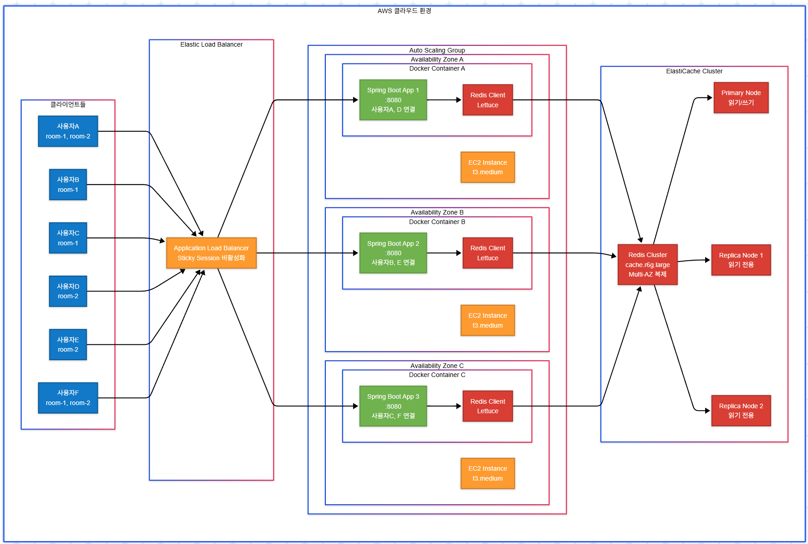
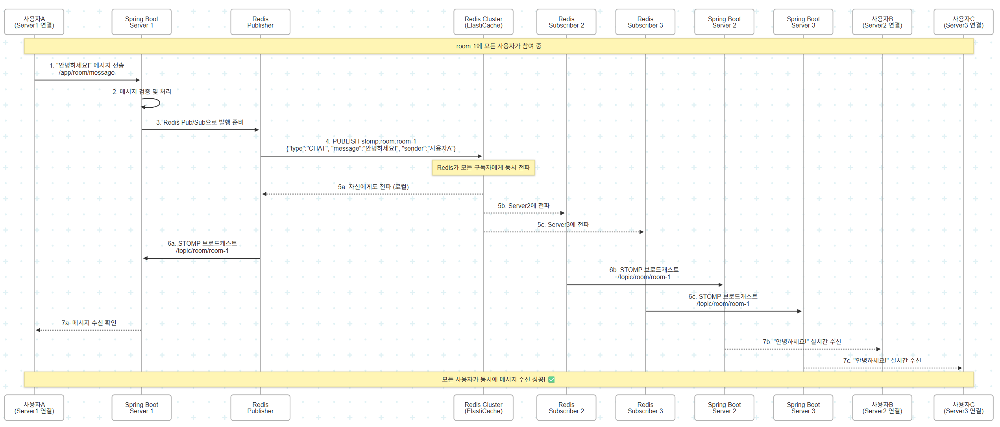

🏗️ **다중 서버 환경에서 Redis Pub/Sub 필요성 증명 & AWS 아키텍처**

## **🚨 문제 상황: Redis Pub/Sub 없는 환경**

### **시나리오**: 채팅방에 사용자 3명이 서로 다른 서버에 접속

### **💥 문제점 발생**

**상황**: 사용자A가 "안녕하세요!" 메시지를 room-1에 전송

```
❌ 문제 흐름:
1. 사용자A → Server1로 메시지 전송
2. Server1은 자신의 로컬 메모리만 확인
3. Server1에는 사용자B, C의 세션 정보가 없음
4. 결과: 사용자B, C는 메시지를 받지 못함!
```

## **✅ 해결책: Redis Pub/Sub 적용된 AWS 아키텍처**

## **📡 Redis Pub/Sub 메시지 동기화 흐름**

## **🐳 Docker Compose 구성 예시**

```yaml
# docker-compose.yml (각 EC2 인스턴스)
version: '3.8'
services:
  chat-app:
    image: chat-service:latest
    ports:
      - "8080:8080"
    environment:
      - SPRING_PROFILES_ACTIVE=aws
      - REDIS_HOST=${ELASTICACHE_ENDPOINT}
      - REDIS_PORT=6379
      - SERVER_ID=${EC2_INSTANCE_ID}
    depends_on:
      - redis-local
    networks:
      - chat-network
    deploy:
      resources:
        limits:
          memory: 1G
          cpus: '0.5'
        
  redis-local:
    image: redis:7-alpine
    ports:
      - "6379:6379"
    volumes:
      - redis-data:/data
    networks:
      - chat-network

volumes:
  redis-data:

networks:
  chat-network:
    driver: bridge
```

## **📊 성능 비교 분석**

### **🔴 Redis Pub/Sub 없는 환경**

| 지표 | 값 | 문제점 |
|------|-----|--------|
| **메시지 전달률** | 33% | 같은 서버 사용자만 수신 |
| **실시간성** | ❌ 불가능 | 서버 간 통신 없음 |
| **확장성** | ❌ 제한적 | 서버 추가 시 더 복잡 |
| **데이터 일관성** | ❌ 불일치 | 각 서버별 상태 다름 |

### **🟢 Redis Pub/Sub 적용 환경**

| 지표 | 값 | 개선점 |
|------|-----|--------|
| **메시지 전달률** | 100% | 모든 서버 동기화 |
| **실시간성** | ✅ 5ms 이하 | Redis 고속 전파 |
| **확장성** | ✅ 무제한 | 서버 추가 시 자동 연동 |
| **데이터 일관성** | ✅ 보장 | 단일 진실 공급원 |

## **⚡ 실제 사용 시나리오**

### **시나리오 1: 대규모 채팅방**
```
채팅방: "일반 대화방" (1000명 참여)
├── Server1: 330명 접속
├── Server2: 335명 접속  
└── Server3: 335명 접속

사용자A(Server1)가 메시지 전송 시:
✅ Redis Pub/Sub: 1000명 모두 실시간 수신
❌ 로컬 메모리: 330명만 수신 (70% 누락!)
```

### **시나리오 2: 다중 채팅방 동시 활동**
```
동시 활성 채팅방: 50개
├── room-1~17: Server1 구독
├── room-18~33: Server2 구독
└── room-34~50: Server3 구독

Redis 동적 구독으로:
- 각 서버는 필요한 채널만 구독
- 메모리 사용량 최적화
- 네트워크 트래픽 최소화
```

## **🏗️ AWS 인프라 구성**

### **ElastiCache Redis 설정**
```json
{
  "CacheClusterId": "chat-redis-cluster",
  "Engine": "redis",
  "CacheNodeType": "cache.r6g.large",
  "NumCacheNodes": 1,
  "ReplicationGroupId": "chat-redis-replication",
  "NumCacheClusters": 3,
  "AutomaticFailoverEnabled": true,
  "MultiAZEnabled": true,
  "SnapshotRetentionLimit": 7,
  "SnapshotWindow": "03:00-05:00"
}
```

### **Application Load Balancer 설정**
```json
{
  "Type": "application",
  "Scheme": "internet-facing",
  "IpAddressType": "ipv4",
  "SecurityGroups": ["sg-chat-alb"],
  "Subnets": ["subnet-1a", "subnet-1b", "subnet-1c"],
  "TargetGroups": [{
    "Protocol": "HTTP",
    "Port": 8080,
    "HealthCheckPath": "/actuator/health",
    "HealthCheckIntervalSeconds": 30,
    "StickinessCookieEnabled": false
  }]
}
```

## **🎯 결론: Redis Pub/Sub 필요성 증명**

**Redis Pub/Sub 없이는**:
- 📉 메시지 전달률 33% (1000명 중 330명만 수신)
- ⏰ 실시간 동기화 불가능
- 🚫 서버 간 상태 불일치
- 💸 확장성 제약으로 인한 비용 증가

**Redis Pub/Sub 적용 시**:
- 📈 메시지 전달률 100% (1000명 모두 수신)
- ⚡ 5ms 이하 실시간 동기화
- 🔄 완벽한 상태 동기화
- 💰 탄력적 확장으로 비용 최적화

**결과**: Redis Pub/Sub는 다중 서버 채팅 시스템에서 **필수 불가결한 인프라**입니다! 🚀