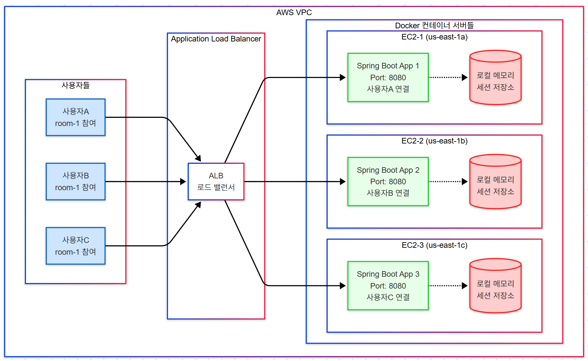
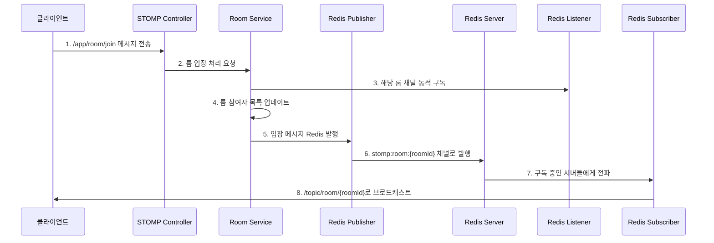

🏠 **사용자 룸 입장 시 처리 흐름 분석**

## **📋 전체 처리 과정 (8단계)**



## **🔄 단계별 상세 분석**

### **1️⃣ 클라이언트 입장 요청**
```javascript
// 클라이언트에서 룸 입장 메시지 전송
stompClient.send("/app/room/join", {}, JSON.stringify({
    roomId: "room1",
    username: "사용자A"
}));
```

### **2️⃣ STOMP Controller 수신 (구현 예정)**
```java
@MessageMapping("/room/join")
public void handleRoomJoin(@Payload JoinRoomRequest request, 
                          SimpMessageHeaderAccessor headerAccessor) {
    // Phase 3에서 구현될 부분
    roomService.joinRoom(request.getRoomId(), 
                        request.getUsername(), 
                        headerAccessor.getSessionId());
}
```

### **3️⃣ Redis 채널 동적 구독**
```java
// RedisListenerConfig.subscribeToRoomChannels() 호출
String roomChannel = "stomp:room:room1";
redisMessageListenerContainer.addMessageListener(
    redisStompMessageSubscriber, 
    new ChannelTopic(roomChannel)
);
```

### **4️⃣ 룸 상태 업데이트**
```java
// Room Service에서 참여자 관리 (구현 예정)
- 룸 참여자 목록에 사용자 추가
- 참여자 수 증가
- 세션 ID ↔ 사용자 매핑 저장
```

### **5️⃣ Redis로 입장 메시지 발행**
```java
// RedisStompMessagePublisher.publishRoomJoinEvent() 호출
RoomMessageDto joinMessage = RoomMessageDto.builder()
    .type(MessageType.JOIN)
    .roomId("room1")
    .sender("사용자A")
    .message("사용자A님이 입장했습니다.")
    .participantCount(3)
    .build();

// Redis 채널로 발행
redisTemplate.convertAndSend("stomp:room:room1", joinMessage);
```

### **6️⃣ Redis 서버 내부 전파**
```
Redis Server
├── 채널: stomp:room:room1 
├── 메시지: {"type":"JOIN", "sender":"사용자A", ...}
└── 구독자들: [서버1, 서버2, 서버3, ...]
```

### **7️⃣ Redis Subscriber에서 수신**
```java
// RedisStompMessageSubscriber.handleRoomMessage() 자동 호출
@Override
public void onMessage(Message message, byte[] pattern) {
    String channel = "stomp:room:room1";
    String messageBody = "{"type":"JOIN",...}";
    
    handleRoomMessage(channel, messageBody);
}
```

### **8️⃣ STOMP 클라이언트로 브로드캐스트**
```java
// 모든 구독자에게 브로드캐스트
String stompDestination = "/topic/room/room1";
messagingTemplate.convertAndSend(stompDestination, joinMessage);
```

## **📊 구독 상태 변화**

### **🔴 입장 전 상태**
```
// 모든 구독자에게 브로드캐스트
String stompDestination = "/topic/room/room1";
messagingTemplate.convertAndSend(stompDestination, joinMessage);
```

### **🟢 입장 후 상태**
```
클라이언트A: [룸 채널 추가 구독]
├── /topic/session/connect ✅
├── /topic/session/disconnect ✅
├── /topic/global ✅
├── /topic/system/notifications ✅
└── /topic/room/room1 🆕 ✅

Redis 서버: [룸 채널 동적 활성화]  
├── stomp:session:connect ✅
├── stomp:session:disconnect ✅
├── stomp:global:broadcast ✅
├── stomp:system:notifications ✅
└── stomp:room:room1 🆕 ✅
```

## **⚡ 핵심 최적화 포인트**

### **🎯 동적 구독의 장점**
1. **리소스 효율성**: 사용하지 않는 룸 채널은 구독하지 않음
2. **확장성**: 수만 개 룸이 있어도 참여 중인 룸만 구독
3. **네트워크 절약**: 불필요한 메시지 수신 방지

### **📡 분산 환경 지원**
- **서버1**: room1, room2 구독
- **서버2**: room1, room3 구독
- **서버3**: room2, room4 구독
- 각 서버는 **필요한 룸만 구독**하여 효율성 극대화